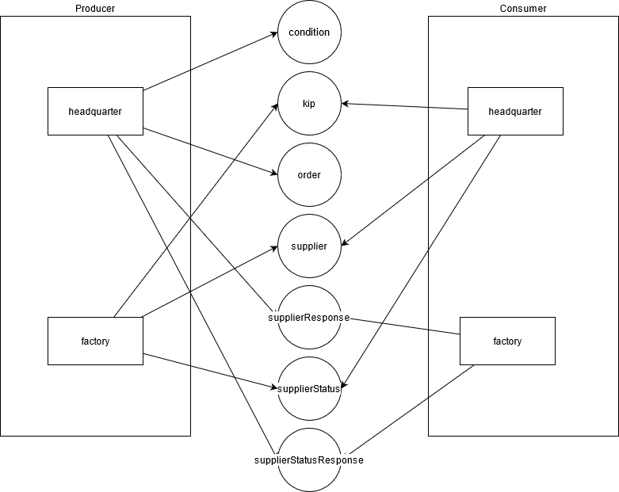

# Headquarter Service

## API DOC

- All Swagger Resources(groups) `http://localhost:8080/documentation/swagger-resources`
- Swagger UI endpoint: `http://localhost:8080/documentation/swagger-ui/`
- Swagger docs endpoint: `http://localhost:8080/v3/api-docs`

## Messaging

Headquarter defines queues:

* conditions
* kip
* order
* conditions
* supplier
* supplierResponse
* supplierStatus
* supplierStatusResponse



## Message Format

### Supplier

#### header

`reply_to : supplierResponse`

#### Queue Message in supplierResponse

```json
{
  "supplierOrders":
  [
    {
      "part_id": "fa671aca-d4e2-11eb-b8bc-0242ac130003",
      "negotiationTimestamp": "2017-02-03T10:37:30.00Z",
      "count": 1
    },
    {
      "part_id": "fa671a02-d4e2-11eb-b8bc-0242ac130003",
      "negotiationTimestamp": "2017-02-03T10:37:30.00Z",
      "count": 1
    },
    {
      "part_id": "7f58bfe8-d418-11eb-b8bc-0242ac130003",
      "negotiationTimestamp": "2017-02-03T10:37:30.00Z",
      "count": 1
    },
    {
      "part_id": "fa67191c-d4e2-11eb-b8bc-0242ac130003",
      "negotiationTimestamp": "2017-02-03T10:37:30.00Z",
      "count": 10
    }
  ]
}
```

### SupplierStatus

#### header

`reply_to : supplierStatusResponse`

#### Queue Message in supplierStatusResponse

```json
{
    "order_id": "c0b221be-d792-11eb-8ef5-0242ac190003"
}
```

### Condition

#### Request

http -v GET localhost:8080/condition/ partId==fa67169c-d4e2-11eb-b8bc-0242ac130003

#### Body
none

#### Queue Message

```json
{
   "part_id":"7f58bfe8-d418-11eb-b8bc-0242ac130003",
   "conditions":[
      {
         "conditions_id":"9d8955dc-d791-11eb-8825-0242ac190003",
         "supplier_id":"8d017b98-d419-11eb-b8bc-0242ac130003",
         "part_id":"7f58bfe8-d418-11eb-b8bc-0242ac130003",
         "price":"1.5500",
         "currency":"USD",
         "negotiation_timestamp":"2021-06-27T21:49:57.733103Z"
      },
      {
         "conditions_id":"9d8991dc-d791-11eb-8825-0242ac190003",
         "supplier_id":"8a34a8fe-d419-11eb-b8bc-0242ac130003",
         "part_id":"7f58bfe8-d418-11eb-b8bc-0242ac130003",
         "price":"1.7000",
         "currency":"USD",
         "negotiation_timestamp":"2021-06-27T21:49:57.733103Z"
      }
   ]
}
```

### Order

#### Request

http -v POST localhost:8080/order/ @orderRequest.json

#### Body aka orderRequest.json
```json
{
	"customer_id": "999ded14-d4ff-11eb-b8bc-0242ac130003",
	"products": [{
			"product_id": "7174a632-d4e3-11eb-b8bc-0242ac130003",
			"count": 2
		},
		{
			"product_id": "82a637fe-d4e3-11eb-b8bc-0242ac130003",
			"count": 1
		},
		{
			"product_id": "8664853a-d4e3-11eb-b8bc-0242ac130003",
			"count": 1
		}
	]
}
```
#### Queue Message

```json
{

  "customer_id":"999ded14-d4ff-11eb-b8bc-0242ac130003",
  "products":[
    {
      "product_id":"7174a632-d4e3-11eb-b8bc-0242ac130003",
      "count":2
    },
    {
      "product_id":"82a637fe-d4e3-11eb-b8bc-0242ac130003",
      "count":1
    },
    {
      "product_id":"8664853a-d4e3-11eb-b8bc-0242ac130003",
      "count":1
    }
  ]
}
```